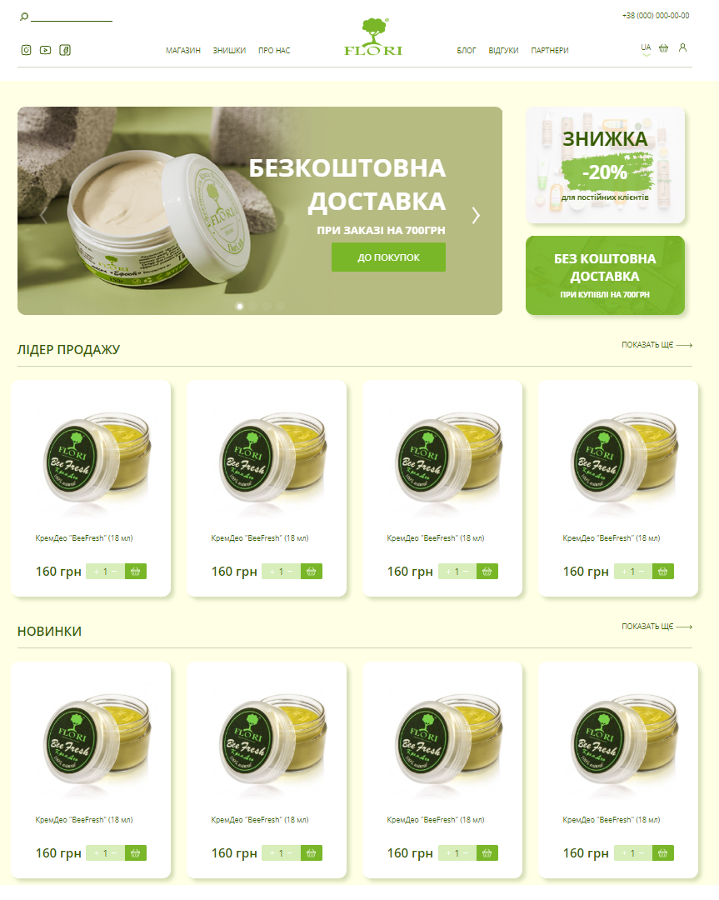
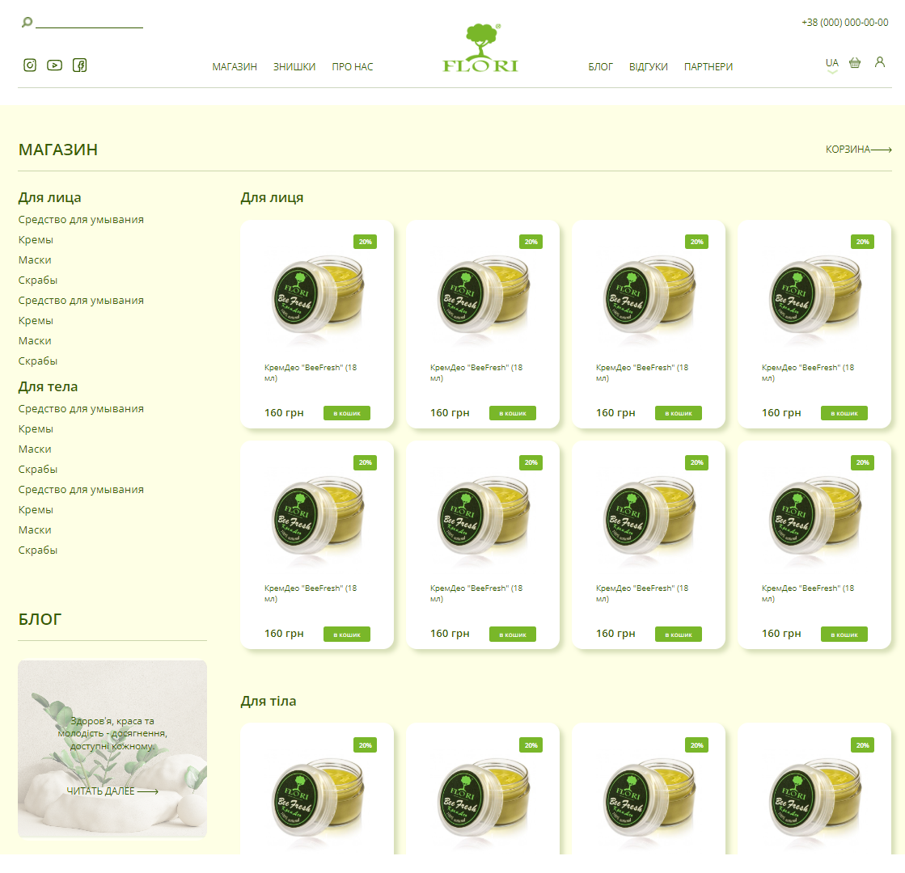
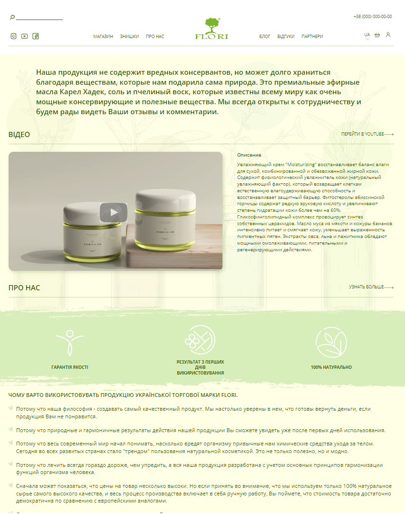
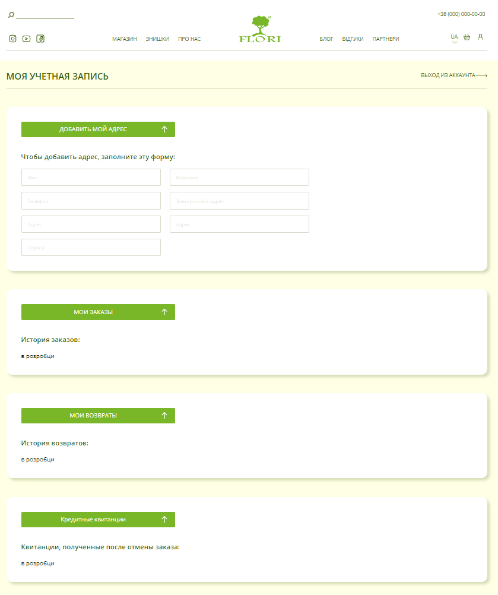
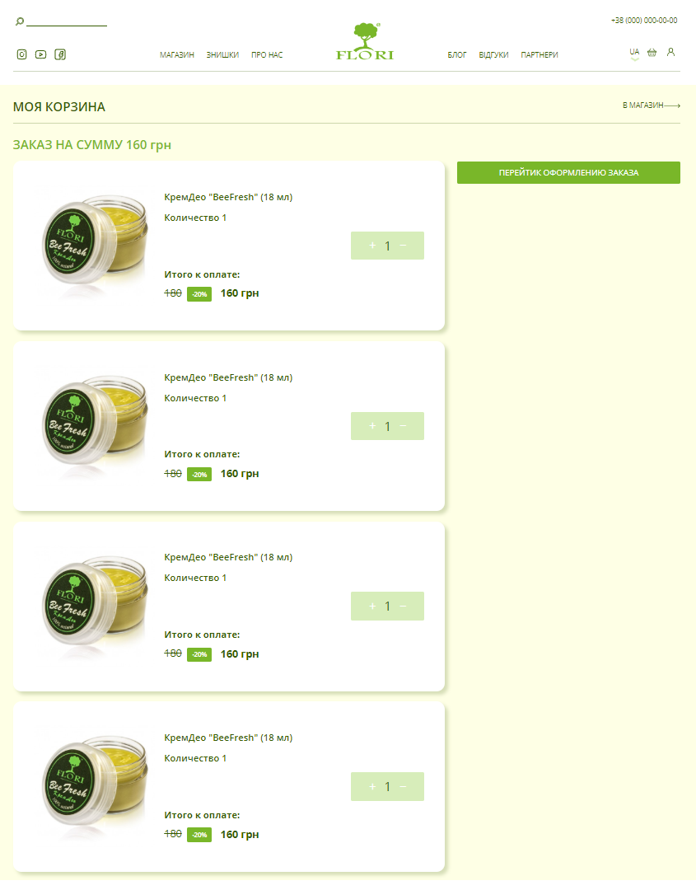
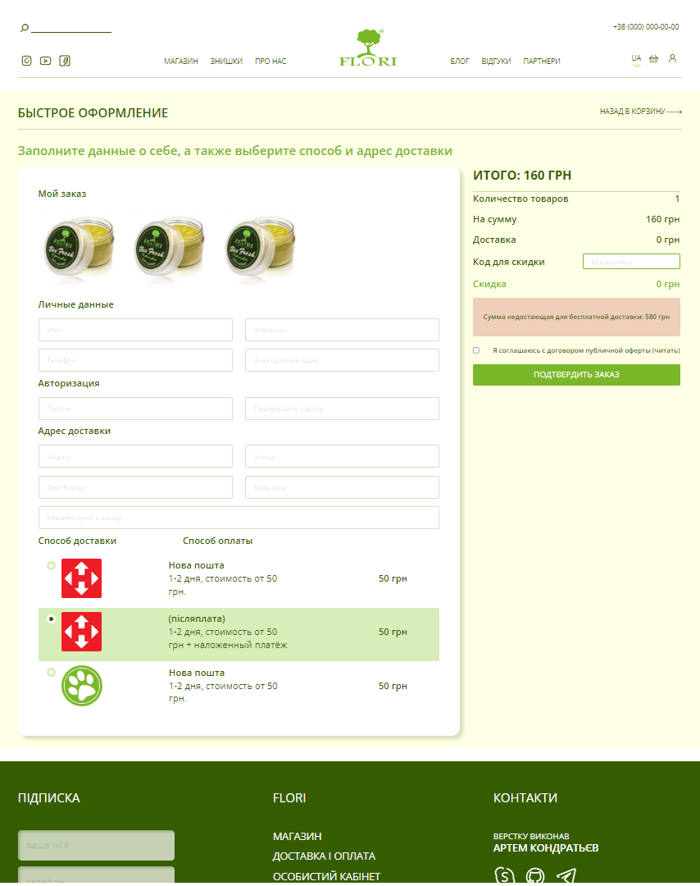
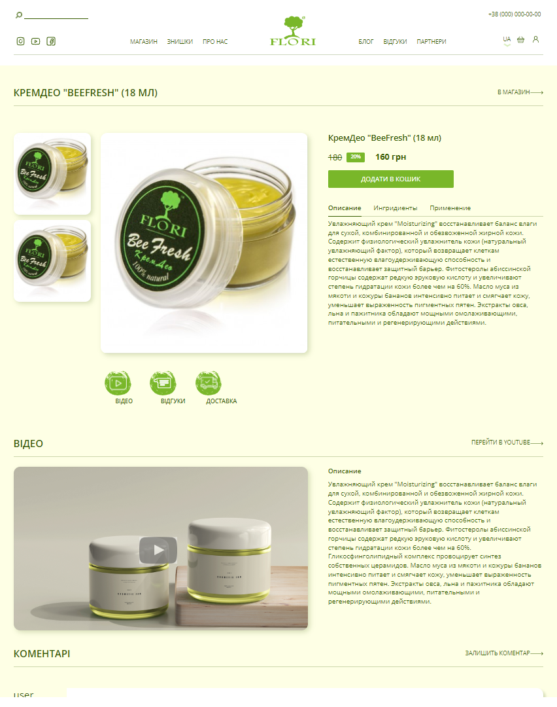
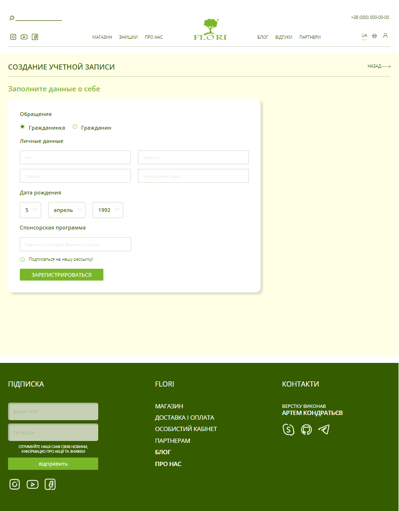

## Інтернет магазин

**🌿 Гілка**: `ui-modul`

**👀 Що зробленно?**

1. Виконанна верстка дизайну.
2. Зверстанно 15 сторінок та модальні вікна.
3. Підключений слайдер Swiper.

**Що далі?**

1. Потрібно зробити Back-End частину.
2. Налаштувати сайт.

**Що використовувалось при версці?**

1. HTML
2. SASS
3. ReactJS
4. Slider Swiper
5. Flex
6. Grid

**Деякі сторінки сайту**

